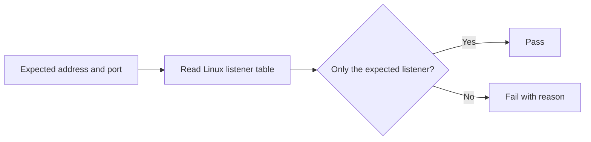

# Is your internal service exposed by mistake?

A read only Linux check that confirms the real TCP address and port before a service goes live.

[Русская версия](README.ru.md)


## The problem in plain language

Many applications run behind Caddy, Nginx or another reverse proxy. The application is expected to accept connections only from the same server.

| Address | What it means |
|---|---|
| `127.0.0.1:8080` | Only processes on this server can connect. |
| `0.0.0.0:8080` | The service listens on every available network interface. |

Both versions can return a healthy application response. A normal healthcheck may therefore stay green even when the service is reachable more broadly than intended.

`check-bind` asks the Linux kernel which address is actually listening. It fails when the answer differs from the expected address.

## Check it in 30 seconds

Requirements: Linux, Bash 4 or newer, and `ss` from `iproute2`.

```bash
chmod +x bin/check-bind
./bin/check-bind --address 127.0.0.1 --port 8080
```

Safe result:

```text
PASS: 127.0.0.1:8080 is the only listener on TCP port 8080
```

Accidental public bind:

```text
FAIL: wildcard listener 0.0.0.0:8080 conflicts with expected 127.0.0.1:8080
```

## What it catches

1. A service listening on `0.0.0.0` instead of localhost.
2. A service that started on a different port.
3. An additional listener on the same port.
4. Exact IPv4 and IPv6 mismatches.

## What this repository includes

1. A dependency free Bash checker.
2. Synthetic examples with no production data.
3. Offline verification from a saved `ss` snapshot.
4. Nine deterministic security and behavior checks.
5. A documented rollback path.

## How it works



## Verify a saved snapshot

Snapshot mode is useful in tests and incident notes. It never runs `ss`.

```bash
./bin/check-bind \
  --address 127.0.0.1 \
  --port 8080 \
  --snapshot examples/ss-localhost.txt
```

Use `--snapshot -` to read from standard input.

## Run the tests

```bash
make test
```

The test suite covers exact IPv4 and IPv6 listeners, wildcard exposure, a wrong specific address, a missing port, invalid input and hostile snapshot text.

## Exit codes

| Code | Meaning |
|---:|---|
| `0` | The selected port has only the expected listener. |
| `1` | No listener exists, or a wildcard or additional address was found. |
| `2` | Arguments, snapshot input or a required command are invalid. |

## Limits

1. `ss` sees only the current network namespace. Run the checker inside the container or namespace that owns the service.
2. Hostnames are not resolved. Pass the literal address shown by `ss`.
3. UDP is outside the current scope.
4. A successful bind check does not prove that the application returns a valid response.
5. This check complements firewall and reverse proxy configuration. It does not replace them.

## Rollback

The checker is read only. If you copied it into a global location, remove that copy:

```bash
sudo rm /usr/local/bin/check-bind
```

Removing the checker does not alter listeners, firewall rules or service configuration.

## Security boundary

The script executes only the fixed command `ss -H -ltn`. Addresses and ports are validated before comparison. Snapshot content is treated as data and is never evaluated or executed.

This repository contains no production credentials, customer data, private infrastructure details or surrounding orchestration.

See [SECURITY.md](SECURITY.md) for responsible reporting.

## License

[MIT](LICENSE)
