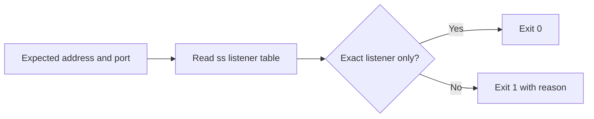

# Bind Address Healthcheck

Verify that a Linux TCP service is listening on the exact address and port you intended.

[Русская версия](README.ru.md)


## Why

A process can be healthy while listening on the wrong interface. A service intended for a local reverse proxy may accidentally bind to `0.0.0.0`, or it may start on a different port while a shallow healthcheck still reports success.

`check-bind` reads the kernel listener table through `ss` and fails unless every listener on the selected port matches the expected address.

## What this repository includes

1. A dependency free Bash checker for Linux.
2. Exact IPv4 and IPv6 address matching.
3. Explicit detection of wildcard and additional listeners.
4. Offline verification from a saved `ss` snapshot.
5. Deterministic tests with synthetic fixtures.

## What it does not include

This tool does not test application responses, firewall policy, container network namespaces or remote reachability. It contains no production credentials, customer data, private infrastructure details or surrounding orchestration.

## How it works



## Quick start

Requirements: Linux, Bash 4 or newer, and `ss` from `iproute2`.

```bash
chmod +x bin/check-bind
./bin/check-bind --address 127.0.0.1 --port 8080
```

Expected result:

```text
PASS: 127.0.0.1:8080 is the only listener on TCP port 8080
```

An accidental wildcard bind fails:

```text
FAIL: wildcard listener 0.0.0.0:8080 conflicts with expected 127.0.0.1:8080
```

## Verify a saved snapshot

The snapshot mode is useful in tests and incident notes. It never runs `ss`.

```bash
./bin/check-bind \
  --address 127.0.0.1 \
  --port 8080 \
  --snapshot examples/ss-localhost.txt
```

Use `--snapshot -` to read from standard input.

## Tests

```bash
make test
```

The test suite covers exact IPv4 and IPv6 listeners, wildcard exposure, a wrong specific address, a missing port and invalid input.

## Exit codes

| Code | Meaning |
|---:|---|
| `0` | The selected port has only the expected listener. |
| `1` | No listener exists, or a wildcard or additional address was found. |
| `2` | Arguments, snapshot input or a required command are invalid. |

## Failure modes

1. `ss` sees only the current network namespace. Run the checker inside the container or namespace that owns the service.
2. A hostname is not resolved. Pass the literal address shown by `ss`.
3. UDP is outside the current scope.
4. A successful bind check does not prove that the application returns a valid response.

## Rollback

The checker is read only. Remove the copied file if you installed it:

```bash
sudo rm /usr/local/bin/check-bind
```

Removing the checker does not alter listeners, firewall rules or service configuration.

## Security boundary

The script executes only the fixed command `ss -H -ltn`. Addresses and ports are validated before comparison. Snapshot content is treated as data and is never evaluated or executed.

Use this as one verification layer, not as proof that a host is secure.

See [SECURITY.md](SECURITY.md) for responsible reporting.

## License

[MIT](LICENSE)
