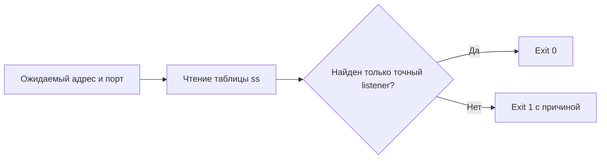

# Проверка bind address сервиса

Проверяет, что Linux сервис слушает именно тот TCP адрес и порт, которые были запланированы.

[English version](README.md)


## Зачем

Процесс может считаться здоровым, хотя слушает не тот интерфейс. Сервис для локального reverse proxy способен случайно открыться на `0.0.0.0`. Другой типовой сбой: приложение стартовало на соседнем порту, а поверхностный healthcheck всё равно оказался зелёным.

`check-bind` читает таблицу TCP listeners через `ss` и завершается ошибкой, если на выбранном порту найден адрес, отличный от ожидаемого.

## Что входит

1. Bash скрипт без сторонних зависимостей.
2. Точное сравнение IPv4 и IPv6 адресов.
3. Отдельное обнаружение wildcard и дополнительных listeners.
4. Проверка сохранённого снимка `ss` без обращения к системе.
5. Детерминированные тесты на синтетических данных.

## Что не входит

Инструмент не проверяет ответ приложения, правила firewall, сетевые пространства контейнеров и удалённую доступность. В репозитории нет боевых доступов, клиентских данных, деталей приватной инфраструктуры и окружающей системы оркестрации.

## Как это работает



## Быстрый старт

Нужны Linux, Bash 4 или новее и команда `ss` из пакета `iproute2`.

```bash
chmod +x bin/check-bind
./bin/check-bind --address 127.0.0.1 --port 8080
```

Успешный результат:

```text
PASS: 127.0.0.1:8080 is the only listener on TCP port 8080
```

Случайный wildcard bind блокируется:

```text
FAIL: wildcard listener 0.0.0.0:8080 conflicts with expected 127.0.0.1:8080
```

## Проверка по снимку

Режим снимка удобен для тестов и разбора инцидентов. Команда `ss` в нём не запускается.

```bash
./bin/check-bind \
  --address 127.0.0.1 \
  --port 8080 \
  --snapshot examples/ss-localhost.txt
```

Значение `--snapshot -` читает стандартный ввод.

## Тесты

```bash
make test
```

Проверяются точные IPv4 и IPv6 listeners, wildcard, другой конкретный адрес, отсутствующий порт, некорректный ввод и враждебный текст снимка.

## Коды завершения

| Код | Значение |
|---:|---|
| `0` | На выбранном порту найден только ожидаемый listener. |
| `1` | Listener отсутствует либо найден wildcard или дополнительный адрес. |
| `2` | Некорректны аргументы, снимок или обязательная системная команда. |

## Ограничения

1. `ss` видит только текущее сетевое пространство. Для контейнера проверку следует запускать внутри нужного network namespace.
2. Имена хостов не разрешаются. Следует передавать буквальный адрес из вывода `ss`.
3. UDP пока не поддерживается.
4. Успешная проверка bind не доказывает, что приложение отдаёт правильный ответ.

## Откат

Проверка ничего не изменяет в системе. Если файл был установлен глобально, достаточно удалить его:

```bash
sudo rm /usr/local/bin/check-bind
```

Удаление инструмента не меняет listeners, firewall и конфигурацию сервиса.

## Граница безопасности

Скрипт запускает только фиксированную команду `ss -H -ltn`. Адрес и порт валидируются до сравнения. Снимок считается данными и никогда не исполняется.

Это один слой проверки, а не доказательство полной безопасности сервера.

Правила ответственного сообщения об уязвимости находятся в [SECURITY.md](SECURITY.md).

## Лицензия

[MIT](LICENSE)
