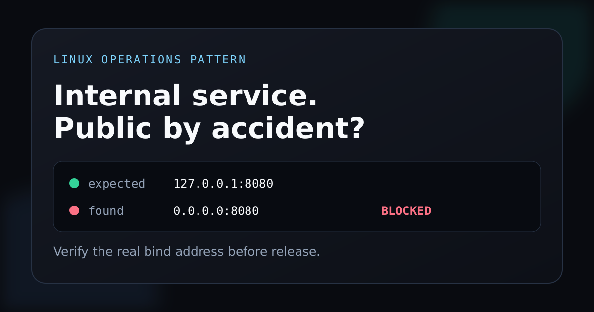
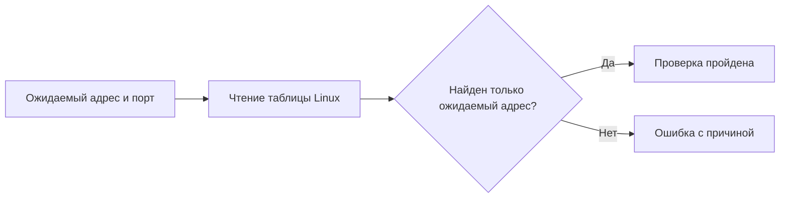

# Внутренний сервис случайно не открыт наружу?

Небольшая проверка для Linux, которая перед запуском подтверждает фактический TCP адрес и порт сервиса.

[English version](README.md)



## Проблема простыми словами

Многие приложения работают за Caddy, Nginx или другим обратным прокси. Само приложение при этом должно принимать подключения только внутри сервера.

| Адрес | Что это означает |
|---|---|
| `127.0.0.1:8080` | Подключиться могут только процессы на этом сервере. |
| `0.0.0.0:8080` | Сервис слушает все доступные сетевые интерфейсы. |

В обоих случаях приложение может отвечать и считаться исправным. Поэтому обычная проверка здоровья останется зелёной, даже если сервис доступен шире, чем планировалось.

`check-bind` спрашивает ядро Linux, какой адрес действительно слушает порт. Если фактический адрес отличается от ожидаемого, проверка завершается ошибкой.

## Проверка за 30 секунд

Нужны Linux, Bash 4 или новее и команда `ss` из пакета `iproute2`.

```bash
chmod +x bin/check-bind
./bin/check-bind --address 127.0.0.1 --port 8080
```

Безопасный результат:

```text
PASS: 127.0.0.1:8080 is the only listener on TCP port 8080
```

Сервис слушает все интерфейсы:

```text
FAIL: wildcard listener 0.0.0.0:8080 conflicts with expected 127.0.0.1:8080
```

## Какие ошибки обнаруживаются

1. Сервис слушает `0.0.0.0` вместо локального адреса.
2. Сервис запустился на другом порту.
3. На том же порту появился дополнительный слушающий адрес.
4. Фактический IPv4 или IPv6 адрес отличается от ожидаемого.

## Что находится в репозитории

1. Bash скрипт без сторонних зависимостей.
2. Синтетические примеры без производственных данных.
3. Проверка по сохранённому выводу `ss` без обращения к системе.
4. Девять детерминированных проверок поведения и безопасности.
5. Описанный способ удаления инструмента.

## Как это работает



## Проверка по сохранённому выводу

Этот режим удобен для тестов и разбора инцидентов. Команда `ss` в нём не запускается.

```bash
./bin/check-bind \
  --address 127.0.0.1 \
  --port 8080 \
  --snapshot examples/ss-localhost.txt
```

Значение `--snapshot -` читает стандартный ввод.

## Запуск тестов

```bash
make test
```

Тесты проверяют точные IPv4 и IPv6 адреса, прослушивание всех интерфейсов, другой конкретный адрес, отсутствующий порт, некорректный ввод и поддельный снимок с управляющим текстом.

## Коды завершения

| Код | Значение |
|---:|---|
| `0` | На выбранном порту найден только ожидаемый адрес. |
| `1` | Порт не слушается либо найден общий или дополнительный адрес. |
| `2` | Некорректны аргументы, сохранённый вывод или обязательная системная команда. |

## Ограничения

1. `ss` видит только текущее сетевое пространство. Для контейнера проверку нужно запускать внутри его пространства сети.
2. Имена хостов не преобразуются в IP. Следует передавать буквальный адрес из вывода `ss`.
3. UDP пока не поддерживается.
4. Успешная проверка адреса не доказывает, что приложение отдаёт правильный ответ.
5. Инструмент дополняет настройки сетевого экрана и обратного прокси, но не заменяет их.

## Удаление

Проверка ничего не изменяет в системе. Если файл был установлен глобально, достаточно удалить его:

```bash
sudo rm /usr/local/bin/check-bind
```

Удаление инструмента не меняет сетевые подключения, правила доступа и конфигурацию сервиса.

## Граница безопасности

Скрипт запускает только фиксированную команду `ss -H -ltn`. Адрес и порт валидируются до сравнения. Сохранённый вывод считается данными и никогда не исполняется.

В репозитории нет рабочих доступов, клиентских данных, деталей приватной инфраструктуры и окружающей системы автоматизации.

Правила ответственного сообщения об уязвимости находятся в [SECURITY.md](SECURITY.md).

## Лицензия

[MIT](LICENSE)
